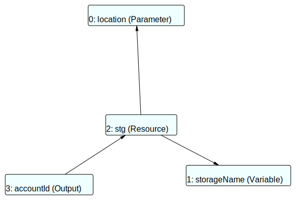
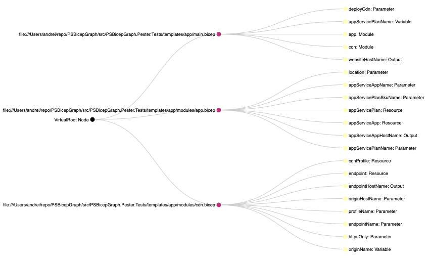
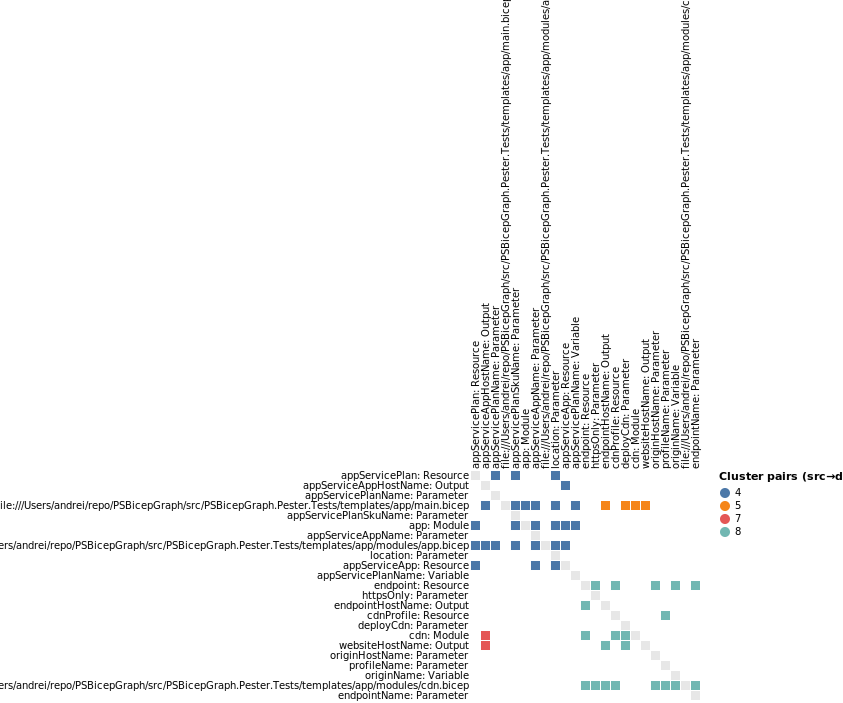

# PSBicepGraph

*PowerShell module for analysing and visualising dependencies inside Bicep templates using [PSGraph](https://github.com/eosfor/PSGraph).*

Bicep is a declarative language for Azure infrastructure. As your templates grow in size and you start composing them from multiple files, understanding how variables, parameters, resources and modules relate to each other becomes difficult. PSBicepGraph builds a semantic dependency graph from your Bicep source files and returns a PsBidirectionalGraph object. You can then export or analyse this graph using the rich tools provided by the PSGraph module – including GraphViz export, design‑structure matrix generation and clustering.

## Installation

The module is published to the PowerShell Gallery. Install it, together with PSGraph, with a single command:

```pwsh
Install-Module -Name PSBicepGraph -Repository PSGallery -Scope CurrentUser
Install-Module -Name PSGraph      -Repository PSGallery -Scope CurrentUser
```

Import the modules before using the cmdlets:

```pwsh
Import-Module PSBicepGraph
Import-Module PSGraph
```

## How it works

- **Semantic graph extraction**. The cmdlet New‑BicepSemanticGraph registers Bicep services, resolves the entry point path and recursively collects all referenced .bicep files. It builds a compilation object and then walks each semantic model with a custom DependencyCollectorVisitor, which maps every declaration (parameters, variables, resources, modules, outputs, functions and types) to the declarations it references. The visitor resolves each syntax node to a semantic symbol and records a full dependency map.
- **Graph construction**. Once the dependency map is built, the module constructs an in‑memory PsBidirectionalGraph and populates it with vertices and edges. For each declaration, a vertex labelled with the declaration name and kind is added and edges are created to all dependent declarations. The resulting graph is written to the pipeline.
- **PSGraph integration**. Because the output graph is a PsBidirectionalGraph, you can pipe it directly into PSGraph cmdlets to analyse or visualise it. PSGraph supports exporting graphs to GraphViz (Export‑Graph), building design‑structure matrices, clustering and more.

## Quick start

**Generate a graph for a single file**

Create a simple Bicep file (`storage.bicep`):

```bicep
param location string = resourceGroup().location
var storageName = 'st${uniqueString(resourceGroup().id)}'

resource stg 'Microsoft.Storage/storageAccounts@2023-01-01' = {
  name: storageName
  location: location
  sku: {
    name: 'Standard_LRS'
  }
  kind: 'StorageV2'
}

output accountId string = stg.id
```

Run the cmdlet and export the graph:

```pwsh
# build the semantic graph
$graph = New-BicepSemanticGraph -Path ./storage.bicep

# export to HTML
Export-Graph -Graph $graph -Format MSAGL_MDS -Path $Env:TMPDIR/storage.html
```



**Analyse larger projects and build a DSM**

Pass the path to the entry point Bicep file; all imported modules will be included:

```pwsh
# generate the graph across multiple files
$graph = New-BicepSemanticGraph -Path ./main.bicep

# convert to a design‑structure matrix and cluster it
$dsm = New-DSM -graph $graph
$ret = Start-DSMClustering -Dsm $dsm

# export the clustered matrix to a Vega-based visual in HTML
Export-DSM -Result $ret -Format VEGA_HTML -Path $Env:TMPDIR/dsmPartitioned.html
```

```pwsh
$sgFull = New-BicepSemanticGraph -Path "./main.bicep"

$tempDir = [System.IO.Path]::GetTempPath() 
$outFile = Join-Path $tempDir 'x.tree.html'
Export-Graph -Graph $sgFull -Format Vega_TreeLayout -Path $outFile -UseVirtualTreeRoot # the graph has "multiple roots", we need to ad a virtual one to make it a Tree
open $outFile
```



## What is a DSM and why use it?

> NOTE: DSM algorithms are not 100% implemented yet.

A Design Structure Matrix (DSM) is a square matrix that captures dependencies within a system. The same set of entities labels the rows and the columns; a mark at cell (i, j) means “row i depends on column j”.

- Orientation used by PSBicepGraph and PSGraph DSM:
  - Row = consumer, Column = provider
  - An edge A → B in the graph becomes a filled cell at (A, B)

Benefits:
- Scales to large systems: dense graphs become readable, compact matrices.
- Reveals architecture: clustering groups highly interdependent elements into modules.
- Detects cycles and feedback quickly: marks above the diagonal indicate backward dependencies.
- Helps layer and sequence work: reordering rows/columns minimizes feedback and highlights a feasible build/deploy order.
- Quantifiable health metrics: upper‑triangular density, size/number of cycles, propagation cost.

Practical workflow:
- Build a graph: `$g = New-BicepSemanticGraph -Path ./main.bicep`
- Build a DSM: `$dsm = New-DSM -graph $g`
- Cluster: `$ret = Start-DSMClustering -Dsm $dsm -ClusteringAlgorithm Classic` (or Graph)
- Export: `Export-DSM -Result $ret -Format VEGA_HTML -Path $Env:TMPDIR/dsm.html`


**DSM visualisation**

The uploaded diagram below was generated from a real-world multi‑file Bicep project. Each cell in the matrix shows dependencies between declarations; the colours highlight clusters of strongly related components discovered by DSM clustering. Use Export‑DSM to produce similar diagrams from your own templates.

